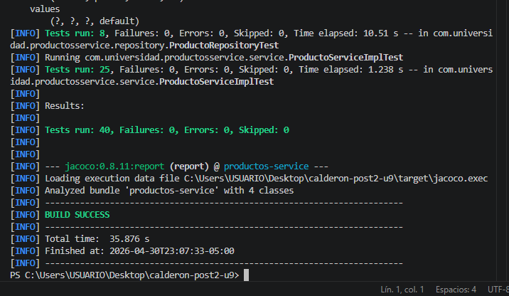
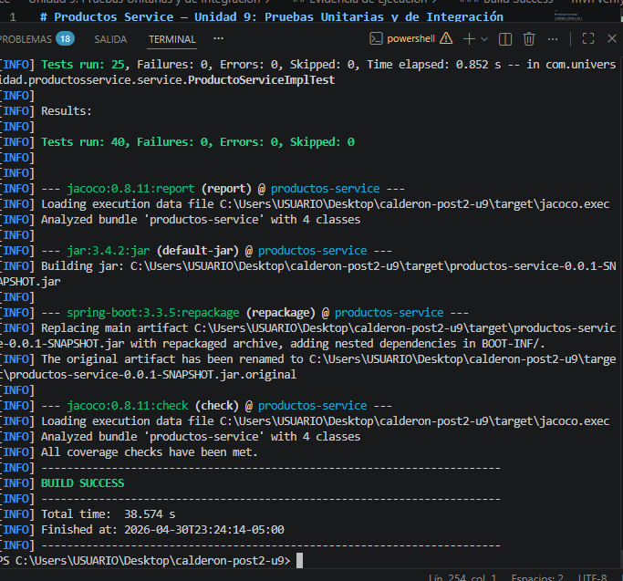
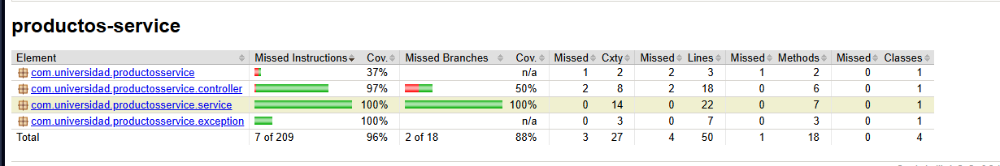

# Productos Service — Unidad 9: Pruebas Unitarias y de Integración

**Patrones de Diseño de Software · Post-Contenido 2 / Unidad 9**
Universidad de Santander (UDES) — Ingeniería de Sistemas 2026

## Descripción del Proyecto

Microservicio de gestión de productos construido con **Spring Boot 3.3.x**, que amplía el Post-Contenido 1 implementando:

- **Pruebas de integración JPA** con `@DataJpaTest` contra H2 en memoria
- **Pruebas de integración Web** con `@WebMvcTest` y `MockMvc`
- **Pipeline de CI/CD** con GitHub Actions que ejecuta todas las pruebas y publica el reporte JaCoCo automáticamente en cada push

El proyecto incluye:
- Entidad JPA `Producto` con campos `id`, `nombre`, `precio` y `stock`
- Repositorio `ProductoRepository` (JpaRepository) con métodos personalizados
- Servicio de negocio `ProductoServiceImpl` con validaciones
- Manejador global de excepciones `GlobalExceptionHandler` (`@RestControllerAdvice`)
- Controlador REST `ProductoController` con endpoints CRUD completos
- **25 pruebas unitarias** en `ProductoServiceImplTest`
- **8 pruebas de integración JPA** en `ProductoRepositoryTest` (`@DataJpaTest`)
- **7 pruebas de integración Web** en `ProductoControllerTest` (`@WebMvcTest`)
- **Total: 40 pruebas** — todas en verde 

---

## Estructura del Proyecto
calderon-post2-u9/
├── .github/
│   └── workflows/
│       └── ci.yml                          ← Pipeline GitHub Actions
├── .gitignore
├── README.md
├── evidencias/
│   ├── evidencia-tests-verde.png
│   ├── evidencia-build-success.png
│   └── evidencia-jacoco.png
└── src/
├── main/
│   ├── java/com/universidad/productosservice/
│   │   ├── ProductosServiceApplication.java
│   │   ├── domain/
│   │   │   └── Producto.java
│   │   ├── repository/
│   │   │   └── ProductoRepository.java
│   │   ├── service/
│   │   │   ├── ProductoService.java
│   │   │   └── ProductoServiceImpl.java
│   │   ├── controller/
│   │   │   └── ProductoController.java
│   │   └── exception/
│   │       └── GlobalExceptionHandler.java
│   └── resources/
│       └── application.properties
└── test/
├── java/com/universidad/productosservice/
│   ├── service/
│   │   └── ProductoServiceImplTest.java
│   ├── repository/
│   │   └── ProductoRepositoryTest.java
│   └── controller/
│       └── ProductoControllerTest.java
└── resources/
└── application-test.properties

---

## Requisitos Previos

| Herramienta | Versión mínima |
|-------------|----------------|
| JDK         | 21             |
| Maven       | 3.9+           |
| IDE         | VS Code + Extension Pack for Java |
| Git         | 2.x            |

---

## Instrucciones de Ejecución

### 1. Clonar el repositorio

```bash
git clone https://github.com/maocalderon/Calderon-post2-u9.git
cd calderon-post2-u9
```

### 2. Compilar el proyecto

```bash
mvn compile
```

### 3. Ejecutar solo pruebas unitarias

```bash
mvn test
```

### 4. Ejecutar todas las pruebas + reporte JaCoCo

```bash
mvn verify
```

El reporte HTML se genera en: `target/site/jacoco/index.html`

### 5. Ejecutar la aplicación

```bash
mvn spring-boot:run
```

La aplicación queda disponible en `http://localhost:8080`

---

## Suite de Pruebas — 40 casos en total

### Pruebas Unitarias — `ProductoServiceImplTest` (25 pruebas)

| Prueba | Tipo | Descripción |
|--------|------|-------------|
| `crear_datosValidos_retornaProductoGuardado` | Happy Path | Crea producto válido, verifica `save()` llamado 1 vez |
| `buscarPorId_existente_retornaProducto` | Happy Path | Retorna producto cuando el id existe |
| `listarTodos_retornaListaDeProductos` | Happy Path | Retorna lista completa |
| `actualizarStock_valorValido_actualizaProducto` | Happy Path | Actualiza y persiste stock |
| `buscarPorId_noExistente_lanzaRuntimeException` | Error | ID 99L → RuntimeException |
| `crear_nombreInvalido_lanzaIllegalArgumentException` | @ParameterizedTest (6 valores) | null, `""`, `" "`, `"\t"`, `"\n"`, `"   "` |
| `crear_precioInvalido_lanzaIllegalArgumentException` | @ParameterizedTest (4 valores) | `0.0`, `-1.0`, `-100.0`, `-0.01` |
| `crear_stockNegativo_lanzaIllegalArgumentException` | @ParameterizedTest (3 valores) | `-1`, `-5`, `-100` |
| `actualizarStock_stockNegativo_lanzaIllegalArgumentException` | Error | Stock < 0 |
| `eliminar_productoInexistente_lanzaRuntimeException` | Error | ID 999L, `deleteById` nunca llamado |
| `crear_nombreConEspacios_guardaNombreNormalizado` | ArgumentCaptor | Verifica `strip()` antes de persistir |
| `eliminar_productoExistente_llamaDeleteById` | Verificación | `findById` y `deleteById` llamados 1 vez |
| `crear_precioNulo_lanzaIllegalArgumentException` | Borde | precio null |
| `crear_stockNulo_lanzaIllegalArgumentException` | Borde | stock null |
| `actualizarStock_productoInexistente_lanzaRuntimeException` | Error | `save()` nunca llamado |

### Pruebas de Integración JPA — `ProductoRepositoryTest` (8 pruebas con `@DataJpaTest`)

| Prueba | Descripción |
|--------|-------------|
| `save_asignaIdAutomaticamente` | H2 asigna id > 0 al persistir |
| `findById_existente_retornaProducto` | Encuentra producto por id real de BD |
| `findById_noExistente_retornaOptionalVacio` | Optional vacío para id 999 |
| `findAll_retornaListaCompleta` | Retorna exactamente 2 productos guardados |
| `deleteById_eliminaProducto` | Producto no existe tras eliminación |
| `findByNombreContainingIgnoreCase_retornaCoincidencias` | Búsqueda parcial insensible a mayúsculas |
| `existsByNombre_nombreExistente_retornaTrue` | true para nombre exacto existente |
| `existsByNombre_nombreInexistente_retornaFalse` | false para nombre que no existe |

### Pruebas de Integración Web — `ProductoControllerTest` (7 pruebas con `@WebMvcTest`)

| Prueba | Endpoint | Descripción |
|--------|----------|-------------|
| `listarProductos_retorna200ConLista` | `GET /api/productos` | 200 + lista de 2 productos |
| `crearProducto_datosValidos_retorna201` | `POST /api/productos` | 201 + producto creado |
| `buscarProducto_noExistente_retorna404` | `GET /api/productos/99` | 404 + mensaje de error |
| `buscarProducto_existente_retorna200` | `GET /api/productos/1` | 200 + datos correctos |
| `crearProducto_nombreInvalido_retorna400` | `POST /api/productos` | 400 + mensaje de validación |
| `actualizarStock_valido_retorna200` | `PATCH /api/productos/1/stock` | 200 + stock actualizado |
| `eliminarProducto_existente_retorna204` | `DELETE /api/productos/1` | 204 No Content |

---

## Endpoints REST

| Método | Endpoint | Descripción | Respuesta |
|--------|----------|-------------|-----------|
| `POST` | `/api/productos` | Crear nuevo producto | 201 Created |
| `GET` | `/api/productos` | Listar todos los productos | 200 OK |
| `GET` | `/api/productos/{id}` | Buscar por ID | 200 OK / 404 |
| `PATCH` | `/api/productos/{id}/stock` | Actualizar stock | 200 OK |
| `DELETE` | `/api/productos/{id}` | Eliminar producto | 204 No Content |

### Ejemplos con curl

```bash
# Crear producto
curl -X POST http://localhost:8080/api/productos \
  -H "Content-Type: application/json" \
  -d '{"nombre":"Laptop","precio":1500.0,"stock":10}'

# Listar todos
curl http://localhost:8080/api/productos

# Buscar por ID
curl http://localhost:8080/api/productos/1

# Actualizar stock
curl -X PATCH http://localhost:8080/api/productos/1/stock \
  -H "Content-Type: application/json" \
  -d '{"stock":25}'

# Eliminar
curl -X DELETE http://localhost:8080/api/productos/1
```

---

## Pipeline GitHub Actions

El archivo `.github/workflows/ci.yml` configura un pipeline que se ejecuta automáticamente en cada `push` o `pull_request` a `main`:

1. **Checkout** del repositorio
2. **Configurar JDK 21** (distribución Temurin)
3. **Compilar y ejecutar todas las pruebas** con `mvn -B verify`
4. **Publicar el reporte JaCoCo** como artefacto descargable (7 días de retención)

---

## Cobertura JaCoCo

La capa `service` alcanza **100% de cobertura** en instrucciones y branches, superando el umbral mínimo ≥70% configurado en el `pom.xml`.

---

## Tecnologías Utilizadas

| Tecnología | Versión | Uso |
|------------|---------|-----|
| Spring Boot | 3.3.5 | Framework principal |
| Spring Data JPA | — | Persistencia con H2 en memoria |
| Lombok | — | Reducción de boilerplate |
| JUnit 5 (Jupiter) | — | Framework de pruebas |
| Mockito | — | Mocking para pruebas unitarias |
| MockMvc | — | Pruebas de integración de capa web |
| @DataJpaTest | — | Pruebas de integración de repositorio |
| @WebMvcTest | — | Pruebas de integración de controlador |
| JaCoCo | 0.8.11 | Análisis de cobertura de código |
| GitHub Actions | — | Pipeline de integración continua |
| H2 Database | — | BD en memoria para pruebas |

---

## Evidencia de Ejecución

### Pruebas en verde — `mvn test`



### Build Success — `mvn verify`



 ### Reporte de cobertura JaCoCo
 
